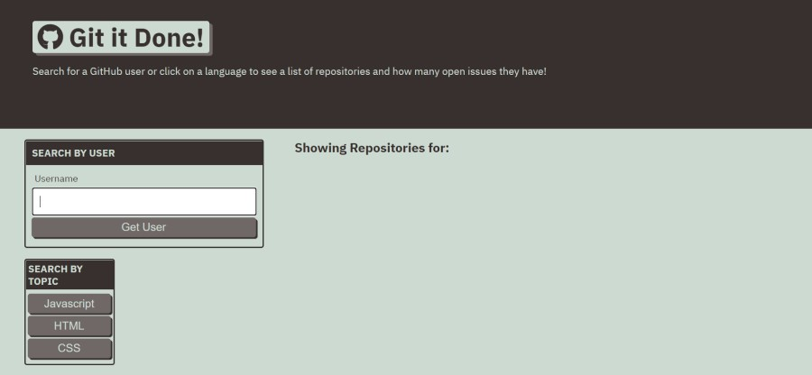
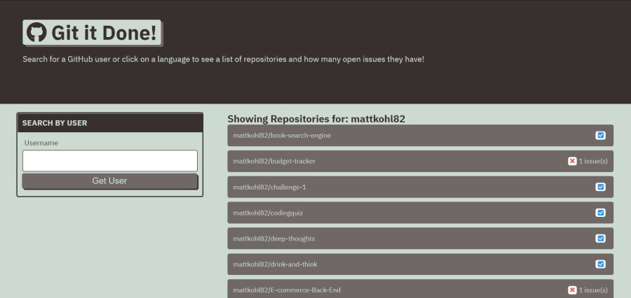

<h1 align="center">Git It Done</h1>

    
    
    
    

  
  

    
    

## Table of Contents
- [Description](#description)
- [Installation](#install)
- [Usage](#usage)
- [Questions](#questions)

## Description
Git It Done is a Web site where you have the abilty to look up GitHub repos by either Usernam or code style. By typing in a users name you will see any repos that are public. You can also choose repos based off of HTML, CSS, or Javascript, and it will provide you with a random repo that uses those coding styles.  
  
## Install
Just clone the repo to your text editor from the GitHub page.

## Usage
Open index.html to use and begin any edits you would like.

## Below is a link to the GitHub repository   
[Git It Done Repo](https://github.com/mattkohl82/git-it-done)    

### Deployed site 
[Git It Done deployed site](https://mattkohl82.github.io/git-it-done/) 

## Questions
#### [Mattkohl82 for GitHub](https://github.com/Mattkohl82)   
#### mattkohl82@gmail.com for ✉️ email 
